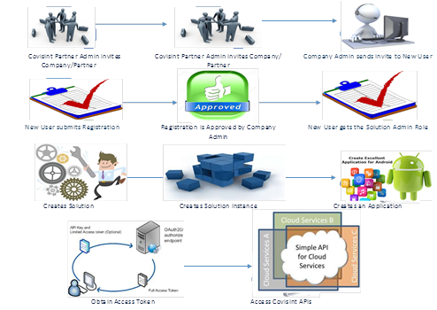

# How-to-Create-an-App-using-Covisint-Developer-Portal
User guide for developers to access Covisint Cloud Platform

**Overview**
	

The Developer Portal is the designated environment used for importing applications, staging, testing, and production. 
The Developer Portal requires an identity realm for managing companies and users with external and internal accounts.
Components of Covisint Developer Portal consist of:

Platform Applications and APIs 
Platform Application Services 
Platform Administration (e.g. SDKs that provide application access to the platform libraries)

For more details: 
https://developer.covisint.com/learn/dp/-/bookdeveloper-portal_portal_solution_center.html
 

To create an application on Covisint Developer Portal the system requirements are:

Eclipse Luna
Java JDK version 8
Local Installation of Liferay 6.2
Maven Central archetype catalog configured

1.0 **Setting Up a Solution Instance**

Solution instances, also known as instances, allow grouping of platform resources to run simultaneously. 
Each instance has its own portal and identity realm, which identifies the instance type and its behavior 
within development, pre-production, or production environment. Instances are the target of deployments for 
releases and create multiple instances for a solution. 

Within the developer portal, once your instance has been successfully provisioned, go back to the Instance page, and click on the instance name to note down the instance details. The admin login Id is always “[SOLUTION ALIAS-INSTANCE ALIAS_ADMIN]”. 
This is the SEED ACCOUNT for this solution instance. 

For more information: https://s-platform-covs.portal.stg.covapp.io/learn/dp/-/book/developer-portal/managing_instances/manage_applications.html

2.0 **Creating an Application using Covisint Developer Portal**

Covisint provides two ways to develop applications: Portlets and OpenSocial Gadgets. Portlets are web applications written with Java and implement the set of rules required to allow cohabitation. With an existing Java Platform, portlets allow building of applications using the same libraries. Portlet containers aggregate the set of portlets that will appear on the designated page. OpenSocial provides the technologies along with a set of APIs allowing the application to gather information from social environments.

2.1 **How to configure your Application to the Developer Portal** 
A webapp must preexist within Eclipse in order to build a WAR File.
For additional information https://en.wikipedia.org/wiki/WAR_(file_format)Wikipedia

The application management screen allows you to register your external application, issues client ID and secret, which is required to access the Platform APIs, and provides a space to manage all the applications you register. to access the management screen:
	Log into Covisint Developer Portal SXP (Covisint)
	Go to Admin
	Go to Ctrl Panel
	Add file to App Mgr> App becomes available on Covisint Platform 
	Select Site to access lab
	Click “Install
	Browse for file 
	Click Install
	Please Note: Instances are available in the “sites” tab, now ready to be deployed
	Choose selection
	Private page>add page>>name>select>done
	Create and empty page 
	Code must be HTML
	HTML (API) will make the call to the portlet
	A container MUST be created for the HTML Code
	Go back into Cov Dev Portal> click add new web content
	Drag and drop portlet to page

3.0 **How to Access the SDK**

The SDK will allow client access to the API at the endpoint. Some of the key features of the Covisint Developer Solution Center include, but not limited to, having the ability to build portlets, self-service deployments, instance management, logging/debugging, and monitoring within the solution. Within the Solution Center, selecting “new application”, identify the application name and description and “save”, grants customization of an application based upon requirement. 
The Covisint SDK dependencies file are available in the library on the Developer Portal.  A solution instance must be created in order to proceed to add applications that will provide the secret access. The AppID, ClientID, and the client secret button will appear. The Class will populate the portlet by default. The SDK client endpoint is created with Covisint API.

For more information: https://github.com/Covisint/samples/tree/master/http-api-clients

3.1 **How to deploy the instance**
Nodes are an open-source cross-platform runtime environment for developing web applications written in JavaScript. Nodes implement programming for web application in JavaScript by allowing reuse of service models and interfaces between client-side and server-side. When deploying release, there is only one required runtime node per instance needed to grant the runtime node of that instance in order to run a copy of the application in its original format. To access the instance for deployment:

	Click the Solutions tab.
	On the left panel of the Solution Center, click Solutions. A list of all the solutions for your company that have    access to the solution center will be displayed.
	Select your solution by clicking on the solution name.
	Click the Instances tab. A list of all the instances for the selected solution will be displayed.
	Select an instance by clicking on the instance name to retrieve an instance.
	Click the Deploy tab.
	Click Deploy a different Release. A list of active solution releases will be displayed.
	Click on the rocket icon next to the desired instance name.  The release will be deployed, and will be available once the nodes have started.
	
The number of portal runtime nodes for a development instance is 1.
The number of portal runtime nodes for a pre-production instance is 2.
By default, the number of portal runtime nodes for a production instance is 2.

